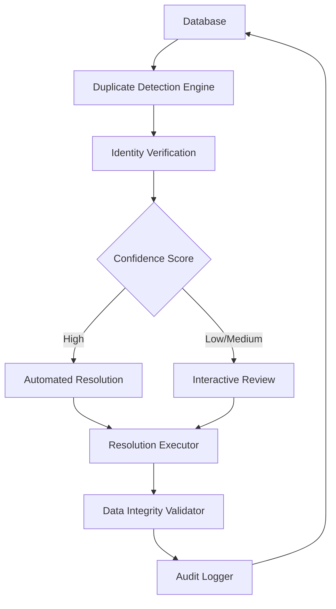

# Design Document

## Overview

This design creates a comprehensive database integrity review system for identifying and resolving duplicate athlete identities in the weightlifting database. The system addresses two primary contamination scenarios: (1) multiple athletes with the same name having their results incorrectly merged under one database record, and (2) a single athlete's results incorrectly split across multiple database records.

The design leverages existing infrastructure including the Sport80 scraping utilities, base64 lookup functionality, and database schema while adding new analysis and resolution capabilities. The system operates in three phases: detection, verification, and resolution, with both automated and interactive components.

## Architecture

The system follows a pipeline architecture with three main stages:



### Detection Phase
- Scans database for potential duplicates using multiple criteria
- Generates athlete fingerprints for matching
- Calculates initial confidence scores
- Produces prioritized list of cases for review

### Verification Phase
- Queries external data sources (Sport80, division rankings)
- Enriches athlete records with additional identifying information
- Recalculates confidence scores with new data
- Routes cases to automated or manual resolution

### Resolution Phase
- Executes merge, split, or verification operations
- Maintains referential integrity across all tables
- Validates data integrity post-operation
- Logs all actions for audit trail

## Components and Interfaces

### Duplicate Detection Engine

**Location**: `scripts/analysis/duplicate-detector.js` (new file)

**Core Functions**:
```javascript
// Main detection function
async function detectDuplicates(options = {}) {
  // Returns array of duplicate cases with confidence scores
}

// Name-based matching
function findNameDuplicates(country = null) {
  // Identifies athletes with identical names
}

// Performance pattern analysis
function analyzePerformancePatterns(athleteId) {
  // Detects suspicious patterns indicating contamination
}

// Confidence scoring
function calculateConfidenceScore(case) {
  // Returns 0-100 score based on multiple factors
}
```

**Database Queries**:
- Query lifters table for name duplicates within countries
- Query meet_results for performance history
- Join with meets table for competition timeline
- Aggregate statistics for pattern analysis

### Identity Verification Module

**Location**: `scripts/analysis/identity-verifier.js` (new file)

**Core Functions**:
```javascript
// Multi-source verification
async function verifyAthleteIdentity(athleteRecord) {
  // Queries Sport80 and division rankings
  // Returns enriched athlete data
}

// Sport80 athlete page scraping
async function scrapeAthletePage(athleteName) {
  // Extracts internal_id from athlete profile
}

// Base64 lookup integration
async function performBase64Lookup(athleteData, dateRange) {
  // Reuses existing scrapeDivisionRankings function
  // Returns membership_number and internal_id
}
```

**Integration Points**:
- Reuses `scrapeOneMeet.js` utilities for Sport80 interaction
- Leverages existing `division_base64_codes.json` for lookups
- Integrates with `database-importer-custom.js` base64 functions

### Interactive Resolution Interface

**Location**: `scripts/analysis/resolution-interface.js` (new file)

**Core Functions**:
```javascript
// Present case for review
async function presentCase(duplicateCase) {
  // Displays comprehensive athlete information
  // Shows performance timeline and competition history
  // Presents resolution options
}

// Capture user decision
async function captureDecision(caseId) {
  // Returns: 'merge', 'split', 'verify-distinct', 'skip'
}

// Batch processing
async function processBatch(cases, autoResolveThreshold = 90) {
  // Processes multiple cases with progress tracking
}
```

**User Interface**:
- Command-line interface with formatted output
- Color-coded confidence indicators
- Tabular display of performance data
- Interactive prompts for decision-making

### Resolution Executor

**Location**: `scripts/analysis/resolution-executor.js` (new file)

**Core Functions**:
```javascript
// Merge two athlete records
async function mergeAthletes(primaryId, secondaryId) {
  // Updates all foreign key references
  // Preserves all unique performance data
  // Returns merge summary
}

// Split athlete record
async function splitAthlete(athleteId, resultAssignments) {
  // Creates new athlete record
  // Reassigns specified results
  // Maintains data integrity
}

// Mark as verified distinct
async function markVerifiedDistinct(athleteIds) {
  // Creates verification record
  // Prevents future false positives
}
```

**Database Operations**:
- Transaction-based operations for atomicity
- Foreign key cascade updates
- Constraint validation
- Rollback on error

### Data Integrity Validator

**Location**: `scripts/analysis/integrity-validator.js` (new file)

**Core Functions**:
```javascript
// Validate database state
async function validateIntegrity() {
  // Checks referential integrity
  // Identifies orphaned records
  // Verifies constraint compliance
}

// Post-operation validation
async function validateResolution(operationType, affectedIds) {
  // Confirms operation success
  // Verifies no data loss
  // Returns validation report
}
```

## Data Models

### Duplicate Case Structure

```javascript
const duplicateCase = {
  case_id: string,              // Unique identifier for this case
  confidence_score: number,     // 0-100 confidence this is a duplicate
  case_type: string,            // 'merge' | 'split' | 'ambiguous'
  athletes: [
    {
      db_lifter_id: number,
      athlete_name: string,
      country_code: string,
      birth_year: number,
      internal_id: number | null,
      membership_number: string | null,
      result_count: number,
      first_competition: date,
      last_competition: date,
      weight_class_range: string,
      performance_summary: {
        best_total: number,
        avg_total: number,
        competition_count: number
      }
    }
  ],
  evidence: {
    name_match: boolean,
    internal_id_match: boolean | null,
    membership_match: boolean | null,
    performance_overlap: boolean,
    timeline_conflict: boolean,
    weight_class_conflict: boolean
  },
  recommended_action: string,   // 'auto_merge' | 'manual_review' | 'split'
  notes: string
};
```

### Resolution Action Log

```javascript
const resolutionLog = {
  log_id: string,
  timestamp: datetime,
  case_id: string,
  action_type: string,          // 'merge' | 'split' | 'verify_distinct'
  affected_lifter_ids: number[],
  result_ids_modified: number[],
  operator: string,             // 'automated' | 'manual'
  confidence_score: number,
  notes: string,
  validation_status: string     // 'success' | 'failed' | 'rolled_back'
};
```

### Verified Distinct Athletes Table

```sql
CREATE TABLE verified_distinct_athletes (
  verification_id BIGSERIAL PRIMARY KEY,
  lifter_id_1 BIGINT REFERENCES lifters(lifter_id),
  lifter_id_2 BIGINT REFERENCES lifters(lifter_id),
  verified_by STRING,
  verified_at TIMESTAMP DEFAULT NOW(),
  notes TEXT,
  UNIQUE(lifter_id_1, lifter_id_2)
);
```

## Correctness Properties

*A property is a characteristic or behavior that should hold true across all valid executions of a system-essentially, a formal statement about what the system should do. Properties serve as the bridge between human-readable specifications and machine-verifiable correctness guarantees.*

### Property 1: Complete Name Duplicate Detection
*For any* database state, all athletes with identical names within the same country should be identified by the duplicate detection engine
**Validates: Requirements 1.1**

### Property 2: Confidence Score Bounds
*For any* duplicate case analysis, the calculated confidence score should be a number between 0 and 100 inclusive
**Validates: Requirements 1.3**

### Property 3: Report Structure Completeness
*For any* generated duplicate case report, it should contain performance timeline, competition patterns, and all required analysis fields
**Validates: Requirements 1.4**

### Property 4: Base64 Lookup Fallback
*For any* athlete verification where internal_id is unavailable, the base64 lookup process should be attempted
**Validates: Requirements 2.2**

### Property 5: Membership Number Inclusion
*For any* athlete verification where membership numbers are available, they should be included in the verification criteria
**Validates: Requirements 2.3**

### Property 6: Conflicting Data Presentation
*For any* verification case with conflicting data sources, all available information should be presented for manual review
**Validates: Requirements 2.4**

### Property 7: Verification Failure Resilience
*For any* verification failure, the system should log the failure and continue processing remaining records without termination
**Validates: Requirements 2.5**

### Property 8: Case Presentation Completeness
*For any* duplicate case presentation, comprehensive athlete information including performance history and competition timeline should be displayed
**Validates: Requirements 3.1**

### Property 9: Merge Data Preservation
*For any* merge operation, all unique performance records from both source athletes should be preserved in the resulting merged record
**Validates: Requirements 3.3, 5.1**

### Property 10: Split Data Conservation
*For any* split operation, the union of performance data across resulting athlete records should equal the original athlete's complete data
**Validates: Requirements 3.4, 5.3**

### Property 11: Action Logging Completeness
*For any* resolution decision (merge, split, verify distinct), a corresponding audit log entry should be created
**Validates: Requirements 3.5, 4.4**

### Property 12: Identical Internal ID Auto-Merge
*For any* pair of athlete records with identical non-null internal_ids, automatic merge should be triggered
**Validates: Requirements 4.1**

### Property 13: Conflicting Internal ID Manual Review
*For any* pair of athlete records with identical names but different non-null internal_ids, manual review should be flagged
**Validates: Requirements 4.2**

### Property 14: Low Confidence Manual Deferral
*For any* duplicate case with confidence score below the configured threshold, manual review should be triggered instead of automatic resolution
**Validates: Requirements 4.5**

### Property 15: Foreign Key Integrity Preservation
*For any* merge or split operation, all foreign key references should remain valid with no orphaned records created
**Validates: Requirements 5.2**

### Property 16: Transaction Rollback on Failure
*For any* resolution operation that encounters an error, all database changes should be rolled back to preserve the original state
**Validates: Requirements 5.4**

### Property 17: Post-Operation Validation
*For any* completed resolution operation, data integrity validation checks should be executed
**Validates: Requirements 5.5**

### Property 18: Identical Performance Detection
*For any* database state, athletes with identical performance records at different meets should be identified as potential duplicates
**Validates: Requirements 6.1**

### Property 19: Temporal Conflict Detection
*For any* athlete, if they have competition results at overlapping meet dates, this should be flagged as an impossible schedule
**Validates: Requirements 6.2**

### Property 20: Batch Error Resilience
*For any* batch processing operation, individual errors should not terminate the entire batch, and all errors should be collected and reported at completion
**Validates: Requirements 7.5**

## Error Handling

### Detection Phase Errors
- Database connection failures: Retry with exponential backoff, fail gracefully if persistent
- Memory constraints during large scans: Process in chunks, provide progress feedback
- Invalid athlete data: Log warnings and continue processing, include in error report

### Verification Phase Errors
- Sport80 connection timeouts: Retry up to 3 times, mark as verification failed if persistent
- Base64 lookup failures: Log failure reason, continue with available data
- Data parsing errors: Log malformed data, use partial information where possible

### Resolution Phase Errors
- Foreign key constraint violations: Rollback transaction, provide detailed error message
- Concurrent modification conflicts: Retry operation, escalate to manual review if persistent
- Data validation failures: Rollback changes, require manual intervention

## Testing Strategy

### Unit Tests
- Name normalization and matching functions with various input formats
- Confidence score calculation with different evidence combinations
- Database query functions with mock data
- Error handling for network failures and malformed data

### Property-Based Tests
- Generate random athlete databases and verify complete duplicate detection
- Test merge operations preserve all data across various athlete combinations
- Verify split operations maintain data conservation with random result assignments
- Test confidence score bounds with randomly generated evidence combinations
- Validate foreign key integrity preservation across random database states

### Integration Tests
- End-to-end duplicate detection and resolution workflow
- Sport80 integration with actual athlete lookups (rate-limited)
- Database transaction rollback behavior under various failure conditions
- Batch processing with mixed success/failure scenarios

The testing approach ensures both specific examples work correctly and universal properties hold across all valid inputs, providing comprehensive coverage while maintaining system reliability and data integrity.