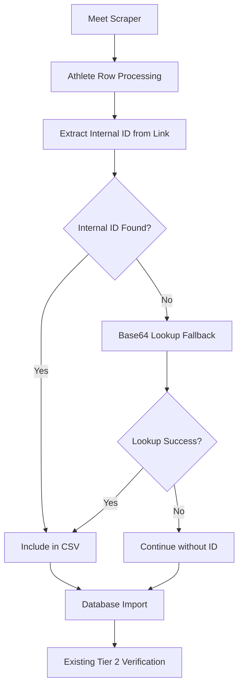

# Design Document

## Overview

This design enhances the existing meet scraping system to extract athlete internal_ids during the scraping process. The enhancement focuses on two key areas: (1) extracting internal_ids directly from athlete profile links during meet scraping, and (2) integrating the existing base64 lookup functionality as a fallback for missing internal_ids.

The design preserves all existing functionality, including the tier 2 Sport80 member URL verification system, while adding internal_id extraction capabilities to prevent athlete duplication.

## Architecture

The enhancement follows a layered approach:



## Components and Interfaces

### Enhanced Athlete Row Processing

**Location**: `utils/scraping_utils.js` - `getAthletesOnPage` function

**Current Behavior**: Extracts text content from athlete table cells
**Enhanced Behavior**: Additionally extracts internal_id from athlete name links

**Interface Changes**:
```javascript
// Current athlete data structure
{
  athleteName: string,
  ageCategory: string,
  weightClass: string,
  // ... other fields
}

// Enhanced athlete data structure  
{
  athleteName: string,
  ageCategory: string,
  weightClass: string,
  internal_id: number | null,  // NEW FIELD
  // ... other fields
}
```

### Base64 Lookup Integration

**Location**: `scripts/maintenance/scrape-missing-meet-ids-fixed.js`

**Integration Point**: After initial athlete data extraction, before CSV writing

**Functionality**: 
- Reuse existing `scrapeDivisionRankings` function from `database-importer-custom.js`
- Apply base64 lookup only for athletes missing internal_ids
- Preserve existing two-tier verification system

### CSV Output Enhancement

**Location**: `utils/scraping_utils.js` and CSV processing functions

**Changes**:
- Add "Internal_ID" column to CSV headers
- Include internal_id values in athlete data rows
- Maintain backward compatibility with existing CSV format

### Database Import Enhancement

**Location**: `scripts/production/database-importer-custom.js`

**Changes**:
- Modify athlete matching logic to prioritize internal_id
- Preserve existing tier 1 and tier 2 verification systems
- Add internal_id update capability for existing records

## Data Models

### Athlete Data Structure

```javascript
const athleteData = {
  // Existing fields (preserved)
  athleteName: string,
  ageCategory: string, 
  weightClass: string,
  club: string,
  total: string,
  // ... other competition data
  
  // New field
  internal_id: number | null
};
```

### CSV Format Enhancement

```
Current: Name|Age Category|Weight Class|Club|Total|...
Enhanced: Name|Age Category|Weight Class|Internal_ID|Club|Total|...
```

## Correctness Properties

*A property is a characteristic or behavior that should hold true across all valid executions of a system-essentially, a formal statement about what the system should do. Properties serve as the bridge between human-readable specifications and machine-verifiable correctness guarantees.*

### Property 1: Internal ID Extraction from Links
*For any* athlete row containing a profile link with `/member/{id}` pattern, the scraper should successfully extract the numeric internal_id
**Validates: Requirements 1.1, 1.2**

### Property 2: CSV Output Consistency  
*For any* athlete data with an internal_id, the CSV output should contain the internal_id in the designated column
**Validates: Requirements 1.3**

### Property 3: Graceful Processing Without Internal ID
*For any* athlete row lacking a profile link, the scraper should continue processing without throwing errors
**Validates: Requirements 1.4**

### Property 4: Internal ID Priority in Matching
*For any* athlete import with both name and internal_id, the database matching should prioritize internal_id over name matching
**Validates: Requirements 2.1**

### Property 5: Duplicate Prevention via Internal ID
*For any* athlete with an internal_id that matches an existing database record, no duplicate record should be created
**Validates: Requirements 2.2**

### Property 6: Internal ID Enrichment
*For any* existing athlete record lacking an internal_id, importing new data with the same athlete's internal_id should update the existing record
**Validates: Requirements 2.3**

### Property 7: Base64 Lookup Fallback Activation
*For any* athlete lacking an internal_id after initial extraction, the base64 lookup process should be triggered
**Validates: Requirements 3.1**

### Property 8: Successful Lookup Integration
*For any* successful base64 lookup result, the retrieved internal_id should be integrated into the athlete record
**Validates: Requirements 3.2**

### Property 9: Resilient Processing on Lookup Failure
*For any* failed base64 lookup attempt, the scraper should continue processing the athlete without the internal_id
**Validates: Requirements 3.3**

## Error Handling

### Internal ID Extraction Errors
- Invalid URL patterns: Log warning and continue without internal_id
- Malformed links: Skip extraction and proceed with base64 lookup fallback
- Network timeouts during base64 lookup: Retry with exponential backoff (max 3 attempts)

### Database Integration Errors
- Internal ID conflicts: Log detailed conflict information for manual review
- Database connection failures: Preserve existing error handling mechanisms
- CSV parsing errors: Maintain backward compatibility with existing error handling

## Testing Strategy

### Unit Tests
- URL parsing functions with various link formats
- CSV output formatting with and without internal_ids
- Database matching logic with different data combinations
- Error handling for malformed data

### Property-Based Tests
- Generate random athlete data and verify internal_id extraction consistency
- Test CSV output format preservation across different data sets
- Verify database matching behavior with various athlete combinations
- Test graceful degradation with missing or invalid data

### Integration Tests
- End-to-end meet scraping with internal_id extraction
- Database import process with enhanced matching logic
- Base64 lookup integration with existing verification systems
- Backward compatibility with existing CSV processing scripts

The testing approach ensures both specific examples work correctly and universal properties hold across all valid inputs, providing comprehensive coverage while maintaining system reliability.