# Design Document: Meet Re-Import System

## Overview

The Meet Re-Import System is focused on completing incomplete meets by identifying meets with missing results and re-scraping them from Sport80. Unlike the gap-filling script that handles missing meets entirely, this system targets existing meets that have fewer results in the database than what exists on Sport80.

The system leverages the existing scraping infrastructure while adding intelligent meet completeness detection, result count comparison, and meet skipping functionality to avoid reprocessing already-complete meets.

## Architecture

### High-Level Architecture

```mermaid
graph TB
    A[Meet Re-Import System] --> B[Meet Completeness Engine]
    A --> C[Result Count Comparator]
    A --> D[Meet Scraping Engine]
    A --> E[Skip Management Engine]
    A --> F[Progress Reporting Engine]
    
    B --> B1[Database Query Module]
    B --> B2[Sport80 Count Extractor]
    B --> B3[Completeness Analyzer]
    
    C --> C1[Sport80 Result Counter]
    C --> C2[Database Result Counter]
    C --> C3[Count Comparison Logic]
    
    D --> D1[Existing scrapeOneMeet]
    D --> D2[Existing database-importer]
    D --> D3[Result Import Handler]
    
    E --> E1[Skip Decision Engine]
    E --> E2[Complete Meet Tracker]
    E --> E3[Skip Status Manager]
    
    F --> F1[Progress Tracker]
    F --> F2[Completion Logger]
    F --> F3[Summary Reporter]
```



### Component Integration

The system uses existing components without modification and leverages their proven athlete matching:
- **scrapeOneMeet.js**: Used as-is for re-scraping meets (includes internal_id extraction and base64 lookup fallback)
- **database-importer-custom.js**: Used as-is for importing results (includes enhanced athlete matching and Tier 2 verification)
- **searchSport80ForLifter.js**: Used by database-importer for athlete verification when needed
- **division_base64_codes.json**: Used by scrapeOneMeet for base64 lookup fallback
- **NEW: meet-completeness-analyzer.js**: Compares Sport80 vs database result counts
- **NEW: meet-skip-manager.js**: Tracks complete meets to avoid reprocessing
- **NEW: re-import-orchestrator.js**: Coordinates the re-import workflow

## Components and Interfaces

### 1. Meet Completeness Engine

**Purpose**: Identify incomplete meets by comparing result counts

**Key Classes**:
```javascript
class MeetCompletenessEngine {
    async getIncompleteMeets(filters = {})
    async analyzeMeetCompleteness(meetId)
    async shouldSkipMeet(meetId) // Check if meet is already complete
}

class ResultCountComparator {
    async getSport80ResultCount(meetId)
    async getDatabaseResultCount(meetId)
    async compareResultCounts(meetId)
    async identifyMissingResults(meetId)
}

class MeetSkipManager {
    async checkMeetCompleteness(meetId)
    async markMeetAsComplete(meetId)
    async shouldSkipMeet(meetId)
}
```

**Core Logic**:
- Query Sport80 meet page to get total result count
- Query database to get current result count for meet
- If counts match and no errors, mark meet as complete (skip in future)
- If counts don't match, mark meet for re-import

**Interfaces**:
- Input: Filter criteria (date range, meet IDs)
- Output: List of incomplete meets needing re-import

### 2. Meet Scraping Engine

**Purpose**: Re-scrape incomplete meets using existing infrastructure with proven athlete matching

**Key Classes**:
```javascript
class MeetReImporter {
    async reImportMeet(meetId)
    async scrapeAndImport(meetId)
    async verifyImportSuccess(meetId)
}
```

**Workflow**:
1. Call existing `scrapeOneMeet(meetId, tempFile)` to scrape (includes internal_id extraction and base64 lookup fallback)
2. Call existing `processMeetCsvFile(tempFile, meetId, meetName)` to import (includes enhanced athlete matching)
3. Verify result count matches Sport80 after import
4. Mark meet as complete if successful

**Athlete Matching Protocol**: Uses the same proven protocol as the gap filler:
- Internal_id extraction during scraping
- Base64 lookup fallback for missing internal_ids
- Enhanced athlete matching during import
- Tier 2 verification when needed

**Interfaces**:
- Input: Meet ID
- Output: Import success status and result counts

### 3. Progress Reporting Engine

**Purpose**: Track and report re-import progress and results

**Key Classes**:
```javascript
class ProgressReporter {
    async logMeetProgress(meetId, status, counts)
    async generateSummaryReport(processedMeets)
    async trackCompletionStats()
}
```

**Interfaces**:
- Input: Meet processing results
- Output: Progress logs and summary reports

### 4. Duplicate Resolution Engine

**Purpose**: Identify and resolve duplicate athlete records

**Key Classes**:
```javascript
class DuplicateResolutionEngine {
    async identifyDuplicates(athleteData)
    async resolveDuplicateCase(duplicateSet)
    async updateAthleteLinks(oldLifterId, newLifterId)
    async preserveDataIntegrity(mergeOperation)
}

class LinkageUpdater {
    async updateMeetResults(oldLifterId, newLifterId)
    async updateForeignKeyReferences(changes)
    async validateDataIntegrity(updates)
}
```

**Interfaces**:
- Input: Duplicate athlete sets
- Output: Resolved athlete records with updated linkages

### 5. Enhanced Tier 2 Verification

**Purpose**: Properly handle paginated Sport80 search results

**Key Classes**:
```javascript
class EnhancedTier2Verifier {
    async searchWithPagination(athleteName, searchCriteria)
    async extractFromAllSearchPages(searchResults)
    async handleSearchResultNavigation(page)
}

class SearchResultProcessor {
    async processSearchPage(page, pageNumber)
    async extractAthleteProfiles(searchResults)
    async navigateToNextPage(page)
}
```

**Enhanced Features**:
- Proper pagination handling for multi-page search results
- Improved athlete profile extraction
- Better error recovery and retry logic
- Enhanced logging for debugging pagination issues

## Data Models

### Meet Completeness Record
```javascript
{
    meetId: number,
    meetInternalId: number,
    sport80ResultCount: number,      // Count from Sport80 meet page
    databaseResultCount: number,     // Count from database
    resultCountMatch: boolean,       // Whether counts match
    isComplete: boolean,             // Whether meet should be skipped
    lastCheckedDate: Date,           // When completeness was last verified
    completionDate: Date,            // When marked complete
    status: 'incomplete' | 'processing' | 'complete' | 'failed' | 'skipped',
    errorLog: string[]
}
```

### Re-Import Session
```javascript
{
    sessionId: string,
    startTime: Date,
    endTime: Date,
    meetsProcessed: number,
    meetsCompleted: number,
    meetsSkipped: number,
    meetsFailed: number,
    totalResultsAdded: number,
    summary: string
}
```

## Correctness Properties

*A property is a characteristic or behavior that should hold true across all valid executions of a system-essentially, a formal statement about what the system should do. Properties serve as the bridge between human-readable specifications and machine-verifiable correctness guarantees.*

### Property 1: Result Count Accuracy
*For any* meet ID, the Sport80 result count should be extracted accurately from the meet page source.
**Validates: Requirements 1.1**

### Property 2: Database Count Accuracy  
*For any* meet ID, the database result count should accurately reflect the number of results currently stored for that meet.
**Validates: Requirements 1.2**

### Property 3: Completeness Detection
*For any* meet where Sport80 count equals database count, the meet should be marked as complete and skipped in future runs.
**Validates: Requirements 1.4**

### Property 4: Incomplete Meet Identification
*For any* meet where Sport80 count exceeds database count, the meet should be identified as incomplete and selected for re-import.
**Validates: Requirements 1.3**

### Property 5: Scraping Integration with Athlete Matching
*For any* incomplete meet, the system should successfully call the existing scrapeOneMeet function which includes internal_id extraction and base64 lookup fallback for accurate athlete identification.
**Validates: Requirements 2.1**

### Property 6: Import Integration with Enhanced Matching
*For any* scraped meet file, the system should successfully call the existing processMeetCsvFile function which includes enhanced athlete matching and Tier 2 verification.
**Validates: Requirements 2.2**

### Property 7: Post-Import Verification
*For any* meet after re-import, the system should verify that the database result count now matches the Sport80 result count.
**Validates: Requirements 2.3**

### Property 8: Skip Status Persistence
*For any* meet marked as complete, subsequent runs of the system should skip that meet without re-processing.
**Validates: Requirements 8.1**

### Property 9: Error Isolation
*For any* meet that fails during re-import, the system should log the error and continue processing other incomplete meets.
**Validates: Requirements 2.4**

### Property 10: Progress Reporting
*For any* re-import session, the system should generate a summary report showing meets processed, completed, and any failures.
**Validates: Requirements 7.4**

<function_calls>
<invoke name="prework">
<parameter name="featureName">meet-re-import-system


## Error Handling

### Error Categories

1. **Scraping Errors**
   - Network timeouts
   - Sport80 rate limiting
   - Invalid meet IDs
   - Missing or malformed HTML

2. **Matching Errors**
   - Ambiguous athlete matches
   - Internal ID conflicts
   - Missing required data fields

3. **Database Errors**
   - Connection failures
   - Transaction rollbacks
   - Constraint violations
   - Referential integrity issues

### Error Handling Strategies

**Graceful Degradation**:
- When Sport80 result count extraction fails, log error and skip meet
- When scraping fails, log error and continue with next meet  
- When import fails, log error and mark meet for retry
- When post-import verification fails, log discrepancy for investigation

**Error Isolation**:
- Wrap each meet processing in try-catch blocks
- Log errors comprehensively but continue with next meet
- Accumulate errors for batch reporting at end

**Retry Logic**:
- Implement exponential backoff for network errors
- Retry rate-limited requests after appropriate delay
- Maximum 3 retry attempts before marking as failed

**Transaction Safety**:
- Use database transactions for all update operations
- Rollback on any error during multi-step operations
- Verify data integrity after each transaction

**Error Reporting**:
- Log all errors with full context (meet ID, athlete data, stack trace)
- Generate error summary reports at completion
- Flag critical errors that require immediate attention

## Testing Strategy

### Dual Testing Approach

The system will be validated using both unit tests and property-based tests:

**Unit Tests**: Verify specific examples, edge cases, and error conditions
- Test specific duplicate resolution cases (e.g., Alvin Tajima case)
- Test error handling for known failure scenarios
- Test integration points between components
- Test database transaction rollback behavior

**Property Tests**: Verify universal properties across all inputs
- Test that filtering always returns meets matching criteria
- Test that pagination always processes all pages
- Test that data integrity is always preserved during updates
- Test that audit logging always captures all changes

### Property-Based Testing Configuration

- **Framework**: fast-check (JavaScript property-based testing library)
- **Iterations**: Minimum 100 iterations per property test
- **Test Tagging**: Each property test must reference its design document property
- **Tag Format**: `// Feature: meet-re-import-system, Property {number}: {property_text}`

### Test Coverage Areas

1. **Meet Selection Tests**
   - Property tests for filter criteria compliance
   - Property tests for priority ordering
   - Unit tests for edge cases (empty database, all gaps, etc.)

2. **Scraping Tests**
   - Property tests for pagination handling
   - Property tests for internal_id extraction
   - Unit tests for Sport80 response parsing
   - Unit tests for rate limiting behavior

3. **Matching Tests**
   - Property tests for matching strategy priority
   - Property tests for disambiguation logic
   - Unit tests for specific athlete matching scenarios
   - Unit tests for ambiguous match handling

4. **Duplicate Resolution Tests**
   - Property tests for data preservation
   - Property tests for merge integrity
   - Unit tests for known duplicate cases
   - Unit tests for conflict detection

5. **Enrichment Tests**
   - Property tests for internal_id enrichment
   - Property tests for conflict detection
   - Unit tests for enrichment edge cases

6. **Logging and Reporting Tests**
   - Property tests for comprehensive audit logging
   - Property tests for summary report generation
   - Unit tests for log format validation

### Integration Testing

- Test end-to-end re-import workflow with test database
- Verify Sport80 scraping with real (but controlled) meet data
- Test database transaction behavior with concurrent operations
- Validate audit trail completeness across full workflow

### Performance Testing

- Test batch processing with large meet sets (100+ meets)
- Verify memory usage remains stable during long-running operations
- Test rate limiting compliance under high load
- Measure and optimize database query performance

## Implementation Notes

### Reusing Existing Infrastructure

The system will leverage and enhance existing components:

1. **scrapeOneMeet.js**: Already has Tier 1.5 extraction and base64 lookup
   - Enhancement: Add re-import mode flag
   - Enhancement: Improve pagination handling in Tier 2

2. **database-importer-custom.js**: Already has athlete matching logic
   - Enhancement: Add duplicate detection
   - Enhancement: Add linkage update capabilities

3. **searchSport80ForLifter.js**: Already has Tier 2 verification
   - Enhancement: Add proper pagination support
   - Enhancement: Add search context preservation

### New Components to Build

1. **meet-completeness-analyzer.js**: New component for comparing Sport80 vs database result counts
2. **meet-skip-manager.js**: New component for tracking complete meets and skip logic
3. **re-import-orchestrator.js**: Main script that coordinates all components

**Athlete Matching**: Uses existing proven infrastructure from gap filler:
- `scrapeOneMeet.js` handles internal_id extraction and base64 lookup fallback
- `database-importer-custom.js` handles enhanced athlete matching and Tier 2 verification
- `searchSport80ForLifter.js` provides athlete verification when needed

### Configuration Options

The system will support command-line configuration:

```bash
# Re-import specific meets
node re-import-meets.js --meet-ids=2308,2357,2369

# Re-import by date range
node re-import-meets.js --start-date=2024-01-01 --end-date=2024-12-31

# Re-import meets with quality issues
node re-import-meets.js --quality-threshold=0.7

# Re-import meets containing specific athlete
node re-import-meets.js --athlete-name="Alvin Tajima"

# Dry run mode
node re-import-meets.js --dry-run --meet-ids=2308

# Batch size control
node re-import-meets.js --batch-size=10 --delay=2000
```

### Database Schema Considerations

No schema changes required, but the system will:
- Update `lifters.internal_id` when enriching
- Update `meet_results.lifter_id` when resolving duplicates
- Maintain referential integrity across all updates
- Use transactions to ensure atomic operations

### Logging and Monitoring

Comprehensive logging at multiple levels:
- **INFO**: Progress updates, successful operations
- **WARN**: Fallback strategies used, ambiguous matches
- **ERROR**: Failed operations, data integrity issues
- **DEBUG**: Detailed scraping and matching information

Log outputs:
- Console output for real-time monitoring
- File logs for audit trail
- Summary reports in JSON format
- Error reports for manual review

## Future Enhancements

1. **Machine Learning Integration**: Use ML models to improve duplicate detection and matching confidence scores

2. **Parallel Processing**: Process multiple meets concurrently with proper rate limiting coordination

3. **Interactive Review UI**: Build web interface for reviewing and approving ambiguous matches

4. **Automated Scheduling**: Run re-import operations on schedule to continuously improve data quality

5. **Performance Analytics**: Track data quality improvements over time and identify patterns in issues

6. **Smart Prioritization**: Use historical data to predict which meets are most likely to have issues